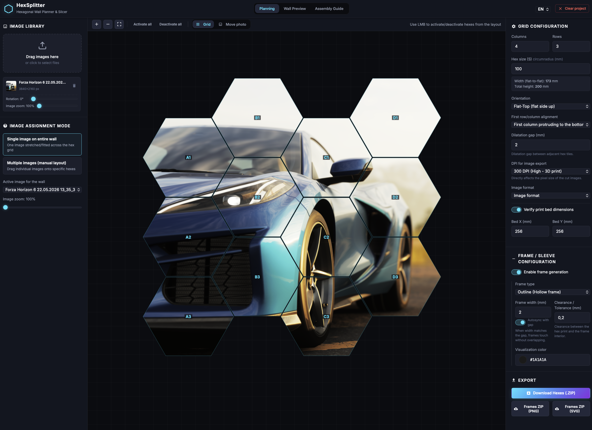

# ⬡ HexSplitter — Hexagonal Wall Planner & Slicer

[English version below](#-english-version)



**HexSplitter** to w pełni kliencka aplikacja webowa służąca do planowania, wizualizacji i cięcia obrazów na siatki sześciokątne (heksagony). Idealna do tworzenia dekoracji ściennych, kolaży zdjęć lub ramek do druku 3D.

---

## ✨ Funkcje

### Planer siatki
- Interaktywna siatka heksagonów z obsługą kliknięcia do aktywacji/dezaktywacji pojedynczych komórek
- Orientacja **Flat-Top** i **Pointy-Top** z konfigurowalnym przesunięciem pierwszego rzędu/kolumny
- Regulowany rozmiar heksagonu (circumradius), przerwy dylatacyjne między kafelkami
- Zoom (przybliżanie/oddalanie) i dopasowanie widoku do ekranu

### Tryby przypisywania obrazów
- **Jeden obraz** — rozciągnięcie jednego zdjęcia na całą kompozycję heksagonów z regulacją zoomu
- **Wiele obrazów** — przeciąganie i kadrowanie oddzielnych zdjęć w konkretnych heksagonach (drag & drop)

### Podgląd ścienny (Wall Preview)
- Realistyczny podgląd gotowej kompozycji na ścianie
- Konfigurowalne tło: ciemne, jasne, tekstura betonu, szachownica (przezroczystość)
- Opcjonalne wyświetlanie: przerwy, etykiety, ramki, linijka skali
- **Kwantyzacja kolorów AMS** — symulacja ograniczeń druku 3D (4/8/16 kolorów)

### Druk 3D
- Weryfikacja wymiarów stołu drukarki (np. 256×256 mm) z ostrzeżeniem o przekroczeniu
- Generowanie ramek: **Outline** (obrys), **Backing plate** (płytka tylna), **Sleeve** (wsuwka z wypustką)
- Regulowana tolerancja (luz) i szerokość ramki, z autosynchronizacją ze szczeliną dylatacyjną

### Eksport
- Masowe pobieranie pociętych heksagonów w archiwum `.zip` (PNG/JPG)
- Konfigurowalne DPI (72/150/300) i jakość JPEG
- Eksport ramek jako PNG lub SVG w oddzielnych archiwach `.zip`
- **Instrukcja montażu** — generowanie gotowego do druku przewodnika PDF z mapowaniem pozycji, wymiarami i kodami heksagonów

### Inne
- 🌍 Pełna wielojęzyczność — polski i angielski
- 🎨 Ciemny interfejs z fontem Inter (Google Fonts)
- 📱 Responsywny layout z trzema zakładkami: Planning, Wall Preview, Assembly Guide

---

## 🚀 Jak uruchomić

Aplikacja działa w 100% po stronie przeglądarki (client-side) i nie wymaga serwera backendowego:

1. Sklonuj repozytorium:
   ```bash
   git clone https://github.com/<user>/hex_splitter.git
   cd hex_splitter
   ```
2. Otwórz `index.html` bezpośrednio w przeglądarce lub uruchom lokalny serwer:
   ```bash
   npx serve .
   ```

> **Uwaga:** Do działania wymagana jest przeglądarka wspierająca ES Modules (Chrome, Firefox, Edge, Safari 15+).

---

## 🧱 Struktura projektu

```
hex_splitter/
├── index.html              # Główny plik HTML z layoutem aplikacji
├── css/
│   └── style.css           # Wszystkie style (ciemny motyw, layout, komponenty)
├── js/
│   ├── app.js              # Punkt wejścia — inicjalizacja, obsługa zdarzeń, stan
│   ├── grid-manager.js     # Zarządzanie siatką heksagonów (aktywacja/dezaktywacja)
│   ├── hex-math.js         # Geometria heksagonów (współrzędne, obrys, kolizje)
│   ├── wall-planner.js     # Renderowanie canvas planera z obrazem i heksagonami
│   ├── preview-renderer.js # Podgląd ścienny (Wall Preview) z tłami i AMS
│   ├── image-processor.js  # Przetwarzanie i kadrowanie obrazów
│   ├── frame-generator.js  # Generowanie ramek (outline, backing, sleeve)
│   ├── export-manager.js   # Eksport ZIP (heksagony, ramki PNG/SVG, PDF)
│   └── i18n.js             # Tłumaczenia PL/EN i system lokalizacji
├── screenshots/
│   └── 1.png               # Screenshot aplikacji
└── README.md
```

---

## 🛠 Technologie

| Warstwa       | Technologia                                  |
|---------------|----------------------------------------------|
| Język         | HTML5, CSS3, JavaScript (ES Modules)         |
| Czcionka      | [Inter](https://fonts.google.com/specimen/Inter) (Google Fonts) |
| Canvas        | HTML5 Canvas 2D API                          |
| Archiwizacja  | [JSZip](https://stuk.github.io/jszip/)       |
| Pobieranie    | [FileSaver.js](https://github.com/nickersPL/FileSaver.js) |
| Backend       | Brak — 100% client-side                      |

---
---

## ⬡ English Version


**HexSplitter** is a fully client-side web application designed to help users plan, visualize, and slice images into hexagonal grids for wall art, photo collages, or 3D-printed hex frames.

---

### ✨ Features

#### Layout Grid
- Interactive hexagonal grid — click to activate/deactivate individual cells
- **Flat-Top** and **Pointy-Top** orientations with configurable row/column stagger
- Adjustable hex size (circumradius), dilatation gaps between tiles
- Zoom in/out and fit-to-screen controls

#### Image Assignment Modes
- **Single Image** — stretches one photo across the entire hexagonal arrangement with zoom control
- **Multi Image** — drag & drop different photos into specific hexagons

#### Wall Preview
- Realistic preview of the finished wall composition
- Configurable backgrounds: dark, light, concrete texture, checkerboard (transparency)
- Optional overlays: gaps, labels, frames, scale ruler
- **AMS Color Quantization** — simulates 3D print color limitations (4/8/16 colors)

#### 3D Print Support
- Print bed size verification (e.g. 256×256 mm) with overflow warnings
- Frame generation: **Outline** (hollow frame), **Backing plate**, **Sleeve** (with lip)
- Adjustable clearance/tolerance and frame width, with auto-sync to dilatation gap

#### Export
- Batch download of sliced hexagons as `.zip` archive (PNG/JPG)
- Configurable DPI (72/150/300) and JPEG quality
- Frame export as PNG or SVG in separate `.zip` archives
- **Assembly Guide** — generates a print-ready PDF with placement codes, dimensions, and layout mapping

#### Other
- 🌍 Full bilingual support — English and Polish
- 🎨 Dark UI theme with Inter font (Google Fonts)
- 📱 Responsive layout with three tabs: Planning, Wall Preview, Assembly Guide

---

### 🚀 How to Run

HexSplitter runs entirely in the browser without any backend:

1. Clone the repository:
   ```bash
   git clone https://github.com/<user>/hex_splitter.git
   cd hex_splitter
   ```
2. Open `index.html` directly in your browser, or serve it using a lightweight local server:
   ```bash
   npx serve .
   ```

> **Note:** Requires a browser with ES Modules support (Chrome, Firefox, Edge, Safari 15+).

---

### 🧱 Project Structure

```
hex_splitter/
├── index.html              # Main HTML with app layout
├── css/
│   └── style.css           # All styles (dark theme, layout, components)
├── js/
│   ├── app.js              # Entry point — init, event handling, state
│   ├── grid-manager.js     # Hex grid management (activation/deactivation)
│   ├── hex-math.js         # Hexagon geometry (coordinates, outlines, hit-tests)
│   ├── wall-planner.js     # Planner canvas rendering with image & hexagons
│   ├── preview-renderer.js # Wall Preview with backgrounds and AMS
│   ├── image-processor.js  # Image processing and cropping
│   ├── frame-generator.js  # Frame generation (outline, backing, sleeve)
│   ├── export-manager.js   # ZIP export (hexagons, frames PNG/SVG, PDF)
│   └── i18n.js             # PL/EN translations and localization system
├── screenshots/
│   └── 1.png               # Application screenshot
└── README.md
```

---

### 🛠 Tech Stack

| Layer         | Technology                                   |
|---------------|----------------------------------------------|
| Language      | HTML5, CSS3, JavaScript (ES Modules)         |
| Font          | [Inter](https://fonts.google.com/specimen/Inter) (Google Fonts) |
| Canvas        | HTML5 Canvas 2D API                          |
| Archiving     | [JSZip](https://stuk.github.io/jszip/)       |
| File saving   | [FileSaver.js](https://github.com/nickersPL/FileSaver.js) |
| Backend       | None — 100% client-side                      |

---

<sub>🤖 Projekt stworzony we współpracy z **Antigravity** (Google DeepMind) · Built with **Antigravity** AI</sub>
